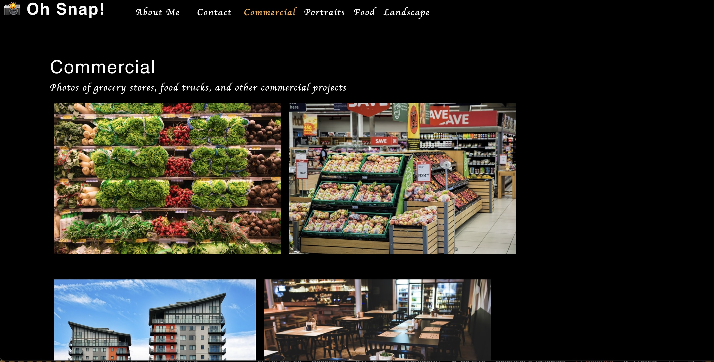

 [] 
# <h1 align="center">Photo Port</h1>

<a href="https://ejackson1228.github.io/photo-port/">Visit the App here!</a>

## Description

A React application built to showcase a photographer's portfolio. 
  
## Table of Contents
  - [Description](#description)
  - [Installation](#installation)
  - [Usage](#usage)
  - [License](#license)
  - [Contributors](#contributors)
  - [Tests](#tests)
  - [Questions](#questions)

## Installation
Clone this repository, install necessary packages, run ``npm start``.

## Usage
This app was built to showcase a fake photographer's portfolio and display my React skills.

## License
[]This application is covered under the MIT license. (https://opensource.org/licenses/MIT)

## Contributors
- React (https://react.dev/)
- gh-pages (https://pages.github.com/)
- jest (https://jestjs.io/)

## Tests
To run all test suites, run ``npm run test`` in the root of the application. To run individual tests, navigate to component folders and run the same command.

## Questions? Contact me:
GitHub: https://github.com/ejackson1228/  
Email: ejackson1228@gmail.com
